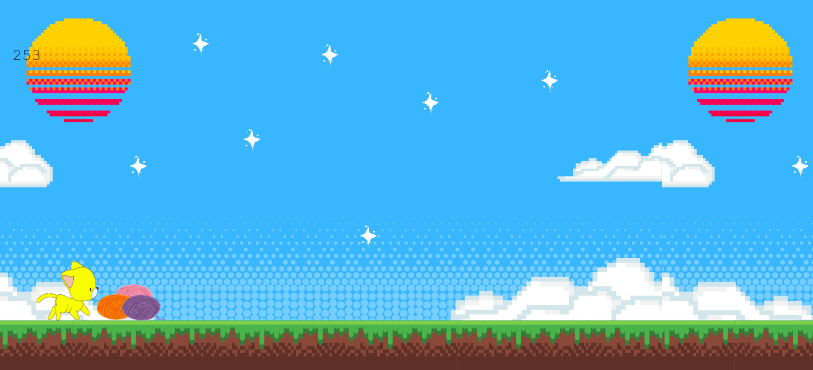

# Jumping Paws

A JavaScript computer game I built to further develop my knowledge and skills.

## What is Jumping Paws?

Jumping Paws is a little yellow cat doing his best to avoid colorful yarn balls as he runs across a moving landscape. Use the space bar on your computer to help the cat jump over the balls and collect a score the longer the cat runs. Once the game is over, press the 'Enter' key to reset your score and play again.

## Built with

- HTML5
- CSS
- JavaScript

    Check out the actual game <a href="https://ceceliabraswell.github.io/Jumping-Paws/">here</a>!

